```mermaid
flowchart TB
    subgraph AUTOMATION["🤖 Automation Layer"]
        SCHEDULER[🐍 Python Schedule<br/><br/>• schedule.every hour.do<br/>• Background thread execution<br/>• Error handling & retry<br/>• Continuous monitoring]
        style SCHEDULER fill:#fff3e0,stroke:#f57c00,stroke-width:3px,color:#f57c00
    end

    subgraph INPUT["🌐 Data Sources"]
        direction TB
        EM[🔌 Electricity Maps API<br/><br/>⚡ Real-time Power Data<br/>🌱 Carbon Intensity Data<br/>]
        style EM fill:#e1f5fe,stroke:#01579b,stroke-width:3px,color:#01579b
    end
    
    subgraph PROCESSING["⚙️ Data Processing Pipeline"]
        direction TB
        FETCH[📡 Data Fetcher<br/><br/>• REST API Client<br/>• Authentication<br/>• Rate limiting]
        CLEAN[🧹 Data Cleaner<br/><br/>• Pandas transforms<br/>• Missing data handling<br/>• Format standardization]
        VALIDATE[✅ Data Validator<br/><br/>• Schema validation<br/>• Quality checks<br/>• Error handling]
        ENRICH[➕ Data Enricher<br/><br/>• Calculated metrics<br/>• Aggregations<br/>• Derived insights]
        
        FETCH --> CLEAN
        CLEAN --> VALIDATE
        VALIDATE --> ENRICH
        
        style FETCH fill:#fff3e0,stroke:#e65100,stroke-width:2px,color:#e65100
        style CLEAN fill:#f3e5f5,stroke:#4a148c,stroke-width:2px,color:#4a148c
        style VALIDATE fill:#e8f5e8,stroke:#1b5e20,stroke-width:2px,color:#1b5e20
        style ENRICH fill:#fce4ec,stroke:#880e4f,stroke-width:2px,color:#880e4f
    end
    
    subgraph STORAGE["💾 Storage Layer"]
        direction LR
        OPERATIONAL[🍃 MongoDB<br/><br/>• Document-based storage<br/>• Operational queries<br/>• Real-time access<br/>• Flexible schema]
        ANALYTICAL[🐘 PostgreSQL<br/><br/>• Time-series tables<br/>• Analytics<br/>• ACID compliance<br/>• Structured queries]
        
        OPERATIONAL -.->|"📊 Data Sync<br/>ETL Process"| ANALYTICAL
        
        style OPERATIONAL fill:#e8f5e8,stroke:#2e7d32,stroke-width:3px,color:#2e7d32
        style ANALYTICAL fill:#e3f2fd,stroke:#1565c0,stroke-width:3px,color:#1565c0
    end
    
    subgraph OUTPUT["📊 Output Layer"]
        direction TB
        DASH[📈 Grafana Dashboards<br/><br/>• Energy mix visualizations<br/>• Carbon trend analysis<br/>• Real-time monitoring<br/>• Custom KPI panels]
        
        style DASH fill:#fff8e1,stroke:#f57f17,stroke-width:3px,color:#f57f17
    end
    
    %% Automation connections
    SCHEDULER ==>|"🕐 Schedule every hour"| FETCH
    SCHEDULER -.->|"🐍 Python orchestration"| PROCESSING
    
    %% Main flow connections
    EM ==>|"🔄 REST Calls<br/>JSON Responses"| FETCH
    ENRICH ==>|"📝 Processed Data"| OPERATIONAL
    
    %% Output connections
    ANALYTICAL ==>|"📊 SQL Queries"| DASH
    
    %% Styling for subgraphs
    style AUTOMATION fill:#fef7e0,stroke:#f57c00,stroke-width:4px,color:#ef6c00
    style INPUT fill:#e8eaf6,stroke:#3f51b5,stroke-width:4px,color:#1a237e
    style PROCESSING fill:#f3e5f5,stroke:#7b1fa2,stroke-width:4px,color:#4a148c
    style STORAGE fill:#e0f2f1,stroke:#00695c,stroke-width:4px,color:#004d40
    style OUTPUT fill:#fff3e0,stroke:#ef6c00,stroke-width:4px,color:#e65100

    %% Custom connection styling
    linkStyle 0 stroke:#f57c00,stroke-width:4px
    linkStyle 1 stroke:#f57c00,stroke-width:2px,stroke-dasharray: 5 5
    linkStyle 2 stroke:#1976d2,stroke-width:4px
    linkStyle 3 stroke:#7b1fa2,stroke-width:3px
    linkStyle 4 stroke:#388e3c,stroke-width:3px
    linkStyle 5 stroke:#f57c00,stroke-width:3px
    linkStyle 6 stroke:#5e35b1,stroke-width:3px
    linkStyle 7 stroke:#d32f2f,stroke-width:2px
    linkStyle 8 stroke:#1976d2,stroke-width:3px
```

# ⚡ Neutrino  
**Real-time Energy Grid Monitoring & Analytics for Turkey**  

Neutrino is a full-stack data engineering platform that continuously tracks Turkey’s **electrical grid performance** and **carbon footprint** in real time.  
It ingests live energy data from the [Electricity Maps API](https://www.electricitymaps.com/), processes it through a scalable ETL pipeline, stores it in optimized databases, and visualizes actionable insights via Grafana dashboards.  

---

---

## 🚀 Features  
- **Live Energy Tracking** – Monitor power generation, consumption, and carbon intensity in real time.  
- **Carbon Footprint Analytics** – Compare renewable vs fossil fuel usage and visualize grid efficiency trends.  
- **Dual-Database Strategy** –  
  - **MongoDB** for operational, raw data storage  
  - **PostgreSQL** for analytics and advanced queries  
- **Grafana Dashboards** – Rich visualizations for decision-making and reporting.  
- **Continuous & Automated** – Runs on a fully containerized Docker environment with automated scheduling.  

---

## 🏗️ Architecture  

### 1. Full-Stack Data Engineering  
- **ETL Pipeline**: Extract → Transform → Load → Sync with smart upsert logic  
- **Real-Time Scheduling**: Continuous ingestion with deduplication & error handling  
- **Multi-Database Design**: Operational + analytical split for performance  

### 2. Production-Ready Infrastructure  
- **Dockerized Microservices**: 5 interconnected services with custom networking  
- **Persistent Volumes**: Durable storage across restarts  
- **Health Checks & Dependency Management**: Reliable service startup and monitoring  

### 3. Robust Security & Reliability  
- Environment variable–based secret management  
- URL encoding for special characters in DB connections  
- Authentication across databases  
- Non-root containerization for enhanced security  

### 4. Scalable Design Patterns  
- Microservices with clear separation of concerns  
- Database connection pooling & optimized queries  
- Modular, reusable codebase  

---

## 📊 Dashboards  
Neutrino provides **Grafana-powered dashboards**:  
- Energy mix (renewable vs fossil fuels)  
- Carbon intensity trends  
- Real-time consumption & generation insights  
- Grid efficiency monitoring  

## 🛠️ Technology Stack

### Core Technologies
- **Python 3.11** - Modern Python runtime with enhanced performance
- **MongoDB 6.0** - Document database for flexible data storage
- **PostgreSQL 15** - Relational database for structured data

### Data Processing & Automation
- **pandas** - Data manipulation and analysis
- **requests** - HTTP library for API interactions
- **schedule** - Job scheduling and automation

### Monitoring & Observability
- **Grafana** - Data visualization and monitoring dashboards
- **Python logging** - Application logging framework
- **traceback** - Error tracking and debugging

### DevOps & Deployment
- **Docker** - Containerization platform
- **Docker Compose** - Multi-container orchestration
---

## Grafana Dashboards

  

  

